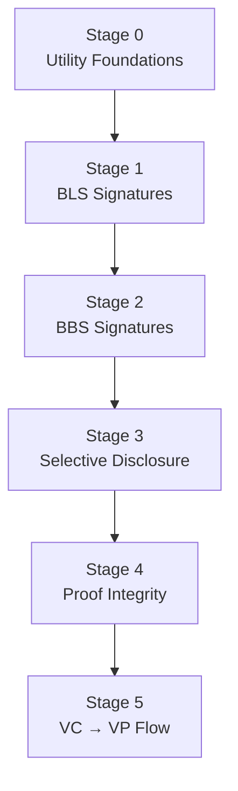
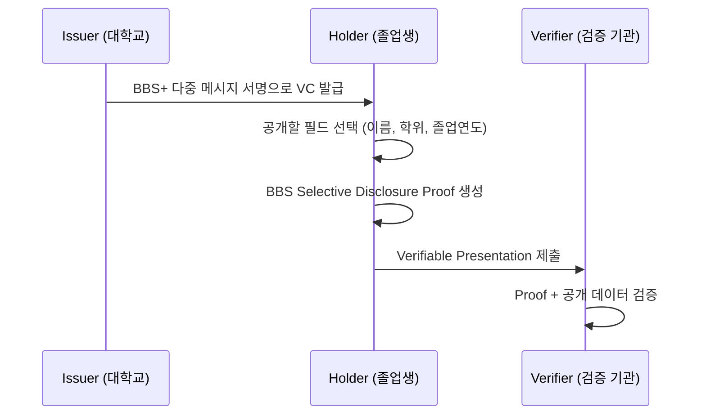

# BBS Selective Disclosure

정확한 선택적 공개 학습을 위해 BBS+ 서명과 BLS 기반 키 관리를 단계별 테스트로 정리한 저장소입니다. 각 테스트 스위트는 학습자가 개념 → 구현 → 실패 시나리오 → VC/VP 흐름까지 자연스럽게 이해할 수 있도록 설계했습니다.

---

## 📚 Stage-Based Learning Path



| Stage | 초점 | 핵심 학습 요소 | 실행 |
| --- | --- | --- | --- |
| Stage 0 | 유틸리티 정합성 | Hex/Byte, 패딩, Nonce | `npm test -- --grep "Stage 0"` |
| Stage 1 | BLS 기본기 | 키 생성, 정상/오류 검증 | `npm test -- --grep "Stage 1"` |
| Stage 2 | BBS 다중 메시지 | 메시지 스키마, 오류 흐름 | `npm test -- --grep "Stage 2"` |
| Stage 3 | 선택적 공개 | 부분 공개, 전체 공개, 정렬 | `npm test -- --grep "Stage 3"` |
| Stage 4 | 무결성 방어 | Nonce/키/데이터 변조 감지 | `npm test -- --grep "Stage 4"` |
| Stage 5 | VC → VP | VC 발급, 선택적 공개 VP | `npm test -- --grep "Stage 5"` |

각 스테이지는 `tests/stage*.test.js`에 위치하며 실행 시 콘솔에 학습 목표와 체크포인트를 함께 출력합니다.

---

## ⚙️ Quick Start

```bash
git clone https://github.com/zenit9hub/bbs-selective-disclosure-js.git
cd bbs-selective-disclosure-js
npm install
npm test                 # 전체 스테이지 실행
npm run test:export      # Stage별 JSON 리포트 생성
npm test -- --grep "Stage 3"  # 특정 스테이지만 실행
```

> Mocha의 `--grep` 옵션으로 원하는 학습 단계만 빠르게 반복할 수 있습니다.

---

## 🧪 What the Tests Teach

- `Stage 0`는 `hexToBytes`, `bytesToHex`, `padMessage`, `generateNonce` 등 이후 모든 서명에 필요한 입력 형식을 확정합니다.
- `Stage 1`은 BLS 서명의 성공/실패 경로를 통해 BBS 이전 단계의 기본기를 다집니다.
- `Stage 2`는 메시지 수와 스키마 불일치가 어떻게 검출되는지, 0개 스키마가 왜 거부되는지 확인합니다.
- `Stage 3`은 선택적 공개 시 인덱스 정렬의 필요성을 실험으로 보여주며, 정렬 전·후 검증 결과를 비교합니다.
- `Stage 4`는 Nonce, 공개키, 메시지 변조에 대한 방어선을 테스트합니다.
- `Stage 5`는 실제 대학 학위 VC를 발급하고, 일부 필드만 공개하는 VP를 생성해 검증까지 이어집니다.

학습용 데이터와 그래프는 `tests/support/learningArtifacts.js` 및 `tests/support/fixtures.js`에서 확인할 수 있으며, 테스트 실행 시 자동으로 안내 메시지가 출력됩니다.

### Stage 리포트 내보내기

- `npm run test:export`를 실행하면 `reports/stage-report.json`이 생성되며, 각 Stage의 총 테스트 수/성공/실패/소요 시간과 개별 테스트 결과가 담깁니다.
- 강의 자료나 대시보드에서 바로 활용할 수 있도록 Stage 목표(`goal`)와 체크 리스트(`keyChecks`)도 포함되어 있습니다.

---

## 🎓 VC → VP 학습 시나리오

Stage 5 테스트는 다음과 같은 흐름을 코드와 함께 검증합니다.



- 샘플 VC는 `tests/support/fixtures.js`의 `universityCredentialFixture()`에서 확인할 수 있습니다.
- `vpSkeleton()`은 공개 필드와 증명을 조합해 학습용 VP 구조를 만듭니다.
- `Stage 5` 테스트는 서명 → 증명 생성 → 검증 과정을 모두 자동화해 학습자가 실행만으로 전체 플로우를 체험할 수 있게 합니다.

---

## 🗂 Project Structure

```
src/
  bbs-core.js          # 공개 API: 키·서명·검증·증명
  keyGeneration.js     # BLS/BBS 키 생성 로직
  signing.js           # BLS/BBS 서명 · 검증 래퍼
  utils.js             # Hex/Nonce/패딩 도우미
tests/
  support/
    fixtures.js        # 학습용 VC/VP, 메시지 변환 유틸
    learningArtifacts.js # 스테이지 메타, 그래프, 로그
  stage0-utils.test.js
  stage1-bls.test.js
  stage2-bbs.test.js
  stage3-selective-disclosure.test.js
  stage4-proof-integrity.test.js
  stage5-vc-vp.test.js
```

---

## 🔗 Library Notes

- [`@mattrglobal/bbs-signatures`](https://github.com/mattrglobal/bbs-signatures) – BBS+ 핵심 구현체
- [`@noble/bls12-381`](https://github.com/paulmillr/noble-bls12-381) – BLS 키 및 서명 도구

> 패키지 보안 업데이트를 위해 정기적인 `npm audit` 실행을 권장합니다.

---

## 🤝 Contributing

학습 스테이지 보강, 추가 테스트, 문서 개선 제안은 언제든 환영합니다. PR을 보내실 때는 새로운 스테이지나 시나리오가 기존 학습 흐름에 어떻게 기여하는지 간단히 설명해주세요.

---

## 🛡 License

This project is licensed under the ISC License.
